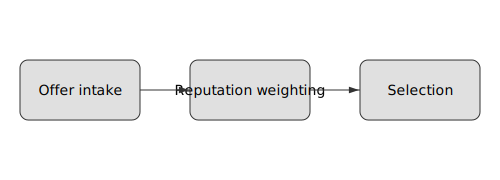

# Compute Market Workloads

The compute market supports running real workloads on job slices. Each slice
contains input data that is executed by a workload runner and produces a proof
hash.

## Mixed CT/IT Escrow

Offers specify `fee_pct_ct`, the consumer-token percentage of the quoted price.
`0` routes the full amount to industrial tokens while `100` pays entirely in
consumer tokens. During admission, buyers escrow the split amounts and
settlement credits providers with the same proportions. Example splits:

| `fee_pct_ct` | CT share | IT share |
|--------------|---------|---------|
| `0`          | `0%`    | `100%`  |
| `25`         | `25%`   | `75%`   |
| `100`        | `100%`  | `0%`    |

Residual escrows are refunded using the original percentages.

## Normalized Compute Units

Workloads are expressed in **compute units** representing GPU-seconds scaled by
device throughput. The reference implementation estimates units as one per MiB
of workload input. Providers post offers with a `units` capacity and
`price_per_unit`, and receipts include the units consumed. Prometheus gauges
`industrial_units_total` and `industrial_price_per_unit` track aggregate demand
and the latest quoted price. Hardware can be calibrated via
`compute_market::workload::calibrate_gpu`, which maps a GPU's GFLOPS rating to
units per second.

### Demand Metrics and Subsidy Interaction

The marketplace exposes `industrial_backlog` and `industrial_utilization`
gauges. `industrial_backlog` counts queued compute units awaiting execution,
while `industrial_utilization` reports realised throughput over the current
window. The subsidy governor samples these metrics through
`Block::industrial_subsidies()` when retuning multipliers, tying pricing to
actual demand.

Sample stats output:

```bash
curl localhost:26658/compute_market.stats
```

```json
{
  "industrial_backlog": 12,
  "industrial_utilization": 0.83,
  "industrial_units_total": 240,
  "industrial_price_per_unit": 5
}
```

High backlog with low utilisation suggests providers are scarce; governance may
raise multipliers or admission targets. Cross-reference
[docs/inflation.md](inflation.md) for how these gauges feed the retuning
mechanics.

## Workload Formats

- **Transcode** – Accepts raw bytes representing media to be transcoded. For the
  reference implementation the bytes are hashed with BLAKE3 and the hash is
  returned as the slice proof.
- **Inference** – Accepts serialized model input bytes. The reference runner
  hashes the input with BLAKE3 and returns the hash as the proof.
- **GPUHash** – Offloads BLAKE3 hashing to a CUDA/OpenCL kernel when available
  and falls back to the CPU otherwise.

Both formats are deterministic; identical inputs always yield the same hash. The
`WorkloadRunner` dispatches to the appropriate reference job based on the
`Workload` enum and returns the proof hash for inclusion in `SliceProof`. Each
slice is processed in a `tokio::task::spawn_blocking` worker, allowing multiple
slices to execute in parallel. Results are cached per slice ID so repeated
invocations avoid recomputation. Parallel execution is deterministic—the same
inputs always yield the same hashes regardless of concurrency.

## Bid Commit–Reveal
Industrial bids use a post-quantum blind signature to hide parameters until reveal:

```
h = blind_sign_cat(salt, state)
```

`h` is broadcast in `BidTx`; after at least two blocks the bidder reveals `(salt,state)` and the signature is verified before execution.

### Capability-Based Scheduling

Providers attach a capability descriptor and a `reputation_multiplier` to each
offer. Jobs specify the minimum capability they require. The scheduler computes
an **effective price** as `price_per_unit * reputation_multiplier` and, when an
accelerator is requested, multiplies by a fixed `1.2×` accelerator premium. It
selects the matching provider with the lowest effective price among those with
non-negative reputation. The multiplier range is bounded by
`reputation_multiplier_min`/`reputation_multiplier_max` in `config.toml` and
defaults to `0.5–1.0`. Reputation starts from the offer's advertised score and is
incremented on successful completion or decremented on failure.

### Scheduler Flow



The scheduler ingests offers, applies reputation multipliers to derive effective
prices, and selects the lowest-cost provider that satisfies the job's capability
requirements.

Prometheus counters `scheduler_match_total{result}` and
`reputation_adjust_total{result}` expose scheduler outcomes and reputation
adjustments. The gauge `scheduler_effective_price{provider}` records the latest
effective price by provider. Unmatched accelerator requests increment
`scheduler_accelerator_miss_total`. Snapshot recent success, failure counts, and
the last effective price with the `compute_market.scheduler_stats` RPC or `net
compute stats --effective` CLI. Query job capability descriptors through
`compute.job_requirements`. Reputation scores persist across restarts in
`~/.the_block/reputation.json` and decay toward zero at the rate configured by
`provider_reputation_decay`.

### Reputation Gossip

Nodes exchange provider scores using a lightweight gossip message carrying
`(provider_id, reputation_score, epoch)` tuples. A manual round can be
triggered with `net reputation sync`, which broadcasts the current snapshot to
known peers. Incoming entries replace local scores only if their epoch is
greater than the stored value and the score lies within `[-1000,1000]`. The
`reputation_gossip_total{result="applied|ignored"}` counter tracks update
processing. Set `reputation_gossip = false` in `config.toml` to opt out of the
protocol.

### Preemption

When `enable_preempt` is set in `config.toml`, the scheduler may migrate an
active job to a higher-reputation provider. An incoming offer whose reputation
exceeds the running provider by at least `preempt_min_delta` triggers a handoff
via the courier. Successful migrations increment
`scheduler_preempt_total{reason="success"}`; handoff failures increment
`scheduler_preempt_total{reason="handoff_failed"}` and leave the original
assignment intact. Preemption counts are exposed through the
`compute_market.scheduler_stats` RPC.

### Cancellations

Consumers or providers may abort an active job via `compute.job_cancel`. The
scheduler releases the slot, refunds posted bonds, and records the event in a
`cancellations.log` ledger for replay protection. The counter
`scheduler_cancel_total{reason="client|provider|preempted"}` tracks aggregate
reasons. Provider reputation adjusts based on the supplied reason: client-driven
cancels do not penalise the worker, while provider faults decrement their
score. Repeated provider-initiated cancellations may incur settlement
penalties.

Cancel a job from the CLI with:

```bash
tb-cli compute cancel <job_id>
```

Sample output on success:

```text
cancelled job abc123
```

Attempting to cancel a completed job returns:

```text
job already completed
```

Exit code `0` indicates success; non-zero codes map to `not_found` or
`already_done` errors. Refunds surface in `compute_market_fee_split`
metrics and the wallet balance. Each cancellation is appended to
`cancellations.log` for replay protection, and reputation impacts are
defined in `node/src/compute_market/scheduler.rs`.

To cancel multiple jobs in bulk:

```bash
for id in $(cat jobs.txt); do tb-cli compute cancel "$id" || true; done
```

Troubleshooting:

- **Timeouts** – increase RPC timeout or verify network reachability.
- **Courier handoff errors** – ensure the courier has acknowledged the
  cancel; reissue if necessary.

See [docs/gossip.md](gossip.md) for general CLI conventions and transport
flags.

### Priority and Aging

Workloads may supply a `priority` field (`low`, `normal`, or `high`) when
submitting a job. The scheduler maintains a priority queue ordered first by
priority and then by arrival time. Older high-priority jobs run before newer
low-priority ones, ensuring fairness under load.

Operators can cap the share of concurrently executing low-priority jobs via
`low_priority_cap_pct` in `config.toml`. Jobs exceeding this cap wait in the
queue until capacity frees. The counter `scheduler_priority_miss_total`
increments if a non-low-priority job waits more than five seconds before
starting. Queue depths and miss counts are available through the
`compute_market.scheduler_stats` RPC.

## Slice Files and Hashing

Slices are raw byte blobs saved with a `.slice` extension. The reference
implementation simply hashes the contents with BLAKE3. Sample slice files and a
`generate_slice.py` helper live under `examples/workloads/`.

`gpu_inference.json` demonstrates requesting an RTX4090-capable provider with 16 GB of VRAM. Additional examples illustrate a
CPU-only task (`cpu_only.json`), a multi-GPU request (`multi_gpu.json`), and an
accelerator-driven workload (`tpu_inference.json`):

```bash
cat examples/workloads/gpu_inference.json
```

To run a sample workload:

```bash
cargo run --example run_workload examples/workloads/transcode.slice
```

Fetch aggregated scheduler statistics with:

```bash
curl -s -d '{"method":"compute_market.scheduler_stats"}' http://localhost:3030 | jq
```

Sample output:

```json
{"success":1,"capability_mismatch":0,"reputation_failure":0,"active_jobs":0,"utilization":{"A100":1}}
```

### GPU Memory Matching

Providers advertise `gpu_memory_mb` alongside the GPU model. Workloads may
require a minimum amount of VRAM, and the scheduler will only match offers that
meet both the model and memory requirements. If no provider has sufficient
memory, the scheduler increments `scheduler_match_total{result="capability_mismatch"}`
for observability.

### Accelerator Requests

Jobs may request specialized accelerators such as TPUs or FPGAs. Providers
advertise `accelerator` and `accelerator_memory_mb` in their capability
descriptor. When a job's accelerator requirement cannot be met—either because no
provider offers the requested model or available memory is insufficient—the
`scheduler_accelerator_miss_total` counter increments to aid capacity planning.

Default reputation decay and retention values are configurable in
`config/default.toml` via `provider_reputation_decay` and
`provider_reputation_retention`.

## Courier Mode

Nodes can operate in a carry-to-earn mode by storing bundle receipts and
forwarding them when connectivity is restored. Use the CLI to manage receipts:

```bash
# store a receipt for bundle.bin from sender alice
node compute courier send bundle.bin alice
# forward all pending receipts
node compute courier flush
```

Receipts are persisted in `sled` until acknowledged and rewards are paid
when forwarding succeeds. Each receipt carries a unique ID and an
`acknowledged` flag set only after successful forwarding. The `compute courier
flush` command retries failed sends with exponential backoff and records
`courier_flush_attempt_total` and `courier_flush_failure_total` Prometheus
counters for observability. Flushing streams entries directly from the
underlying database iterator, so memory usage remains constant even with large
receipt queues.

Integration tests exercise the backoff logic and metric counters. Run

```bash
cargo nextest run --features telemetry compute_market::courier_retry_updates_metrics
```

to verify the retry behaviour and metrics.

For a deep dive into receipt fields, storage paths, and retry semantics see [docs/compute_market_courier.md](compute_market_courier.md).

## Price Board Persistence

Recent offer prices feed a sliding window that derives quantile bands. The board
persists to `node-data/state/price_board.v2.bin` on shutdown and every
`price_board_save_interval` seconds. If the file is missing or corrupted the
board starts empty. The persistence path, window size, and save interval are
configurable via `node-data/config.toml`:

```toml
price_board_path = "state/price_board.v2.bin"
price_board_window = 100
price_board_save_interval = 30
```

Each entry is an unsigned 64‑bit integer, so disk usage is `8 * price_board_window`
bytes (≈800 B for the default). Older prices are dropped as new ones arrive.

Clear the board by deleting the persistence file:

```bash
rm node-data/state/price_board.v2.bin
```

Logs emit `loaded price board` and `saved price board` messages, while metrics
`price_band_p25{lane}`, `price_band_median{lane}`, and `price_band_p75{lane}`
track quantile bands. Suggested bids are adjusted by a backlog factor of
`1 + backlog/window` computed per lane, excluding deferred industrial jobs.

## Receipt Settlement

Matches between bids and asks produce `Receipt` objects that debit CT from the
buyer and pay the provider. Settlement tracks applied receipts in a sled tree to
guarantee idempotency across restarts.

```text
{ version: 1, job_id, buyer, provider, quote_price, units, issued_at, idempotency_key }
```

The `idempotency_key` is `BLAKE3(job_id || buyer || provider || quote_price || units ||
version)` and is used as the primary index in the `ReceiptStore`.  Receipts are
persisted via `compare_and_swap` so duplicates are ignored.  On startup the
store reloads existing entries and increments `receipt_corrupt_total` for any
damaged records.

`Settlement` operates in one of three modes:

- **DryRun** – records receipts without moving balances (default).
- **Armed** – after a configured delay, transitions to `Real`.
- **Real** – debits buyers and pays providers in CT.

Operators can toggle modes via CLI and inspect the current state with the
`settlement_status` RPC, which reports balances and mode.

When `Real`, each finalized receipt subtracts `quote_price * units` from the buyer and
accrues the same amount for the provider with an event tag.  Failures (e.g.,
insufficient funds) are archived and cause the system to revert to `DryRun`.
Metrics track behaviour:

- `settle_applied_total` – receipts successfully debited and paid.
- `settle_failed_total{reason}` – settlement failures.
- `settle_mode_change_total{to}` – mode transitions.
- `matches_total{dry_run}` – receipts processed by the match loop.
- `receipt_persist_fail_total` – database write errors.
- `match_loop_latency_seconds` – time per match-loop iteration.

The `settlement_cluster` test exercises idempotency by applying receipts across
node restarts and asserting that metrics record exactly one application.

## Industrial Admission & Fee Lanes

Every transaction declares a `lane` identifying it as `Consumer` or
`Industrial`. Transactions queue in separate mempools per lane so consumer
traffic stays latency sensitive. Industrial jobs are admitted only when a
moving-window capacity estimator reports enough shard headroom and the comfort
guard is `loose`. When median consumer fees drift above the configured
`comfort_threshold_p90` or the consumer mempool's age p95 exceeds limits, the
system enters a `tight` mode that rejects new industrial jobs until conditions
recover.

Telemetry gauges and counters surface admission behaviour:

- `mempool_size{lane}`
- `consumer_fee_p50`, `consumer_fee_p90`
- `industrial_admitted_total`
- `industrial_deferred_total`
- `industrial_rejected_total{reason}`
- `admission_mode{mode}`
- `industrial_rejected_total{reason="SLA"}` – slashes for missed provider deadlines

These metrics drive Grafana panels tracking fee health and industrial
throttling. Future patches will expose user-facing rejection codes and make
the comfort threshold governable.

Admission decisions are logged with job identifiers, requested shards, and current mode to aid post-mortems.

Providers that miss declared job deadlines have their bonds slashed via `penalize_sla`, incrementing `industrial_rejected_total{reason="SLA"}` for dashboard alerts. Operators should set Prometheus rules to page when this counter rises.

## Fair-Share Caps and Burst Quotas

Admission uses a dual budget model to prevent any single buyer or provider from
monopolizing industrial capacity.  Each call to
`check_and_record(buyer, provider, demand)` in
[`admission.rs`](../node/src/compute_market/admission.rs) evaluates two limits:

1. **Fair-share cap** – The moving window of demand for each party is compared
   against total observed capacity. The cap defaults to
   `FAIR_SHARE_CAP_MICRO = 250_000`, i.e. 25% of the window.
2. **Burst quota** – When the fair-share cap is exceeded, a short-term bucket
   allows extra throughput. `BURST_QUOTA` defaults to 30 micro-shard-seconds and
   refills at `BURST_REFILL_RATE_MICRO` (0.5 µshard·s per second) until the cap
   is replenished.

Usage decays linearly over a 60 s window.  For each buyer and provider a
`Usage` record stores `shards_seconds`; the value is multiplied by
`(WINDOW_SECS - elapsed)/WINDOW_SECS` whenever checked. Quotas are tracked in
`Quota` structs and refilled by the same decay timer.  Both limits are evaluated
before jobs enter the market, returning `RejectReason::{Capacity,FairShare,BurstExhausted}`
on failure.

### Querying Admission Parameters

Governance proposals of type `Admission` can retune the budgets at runtime.
Parameter keys map to fields in `governance::params::Params` and apply via
`Runtime::set_min_capacity`, `set_fair_share_cap`, and `set_burst_refill_rate`.
Operators can inspect current values through the CLI:

```bash
blockctl compute-market params
```

Example JSON output:

```json
{
  "min_capacity": 10,
  "fair_share_cap": 0.25,
  "burst_quota": 30.0,
  "burst_refill_rate": 0.5
}
```

### Troubleshooting

- `INDUSTRIAL_REJECTED_TOTAL{reason="fair_share"}` – buyer or provider exceeded
  the global cap. Verify quotas with `compute-market params` and check the
  `fair_share_cap` value.
- `INDUSTRIAL_REJECTED_TOTAL{reason="burst_exhausted"}` – burst bucket is empty.
  Wait for refill or raise `burst_refill_rate` via governance.
- `INDUSTRIAL_REJECTED_TOTAL{reason="capacity"}` –
  `record_available_shards` reports insufficient headroom. Ensure providers are
  advertising realistic capacity.

Simulation scenarios exercising admission behaviour live under
[`sim/compute_market`](../sim/compute_market/).

## Developer notes

When modifying compute-market code, run `cargo nextest run --features telemetry compute_market::courier_retry_updates_metrics price_board` in addition to the full test suite to exercise persistence paths.
