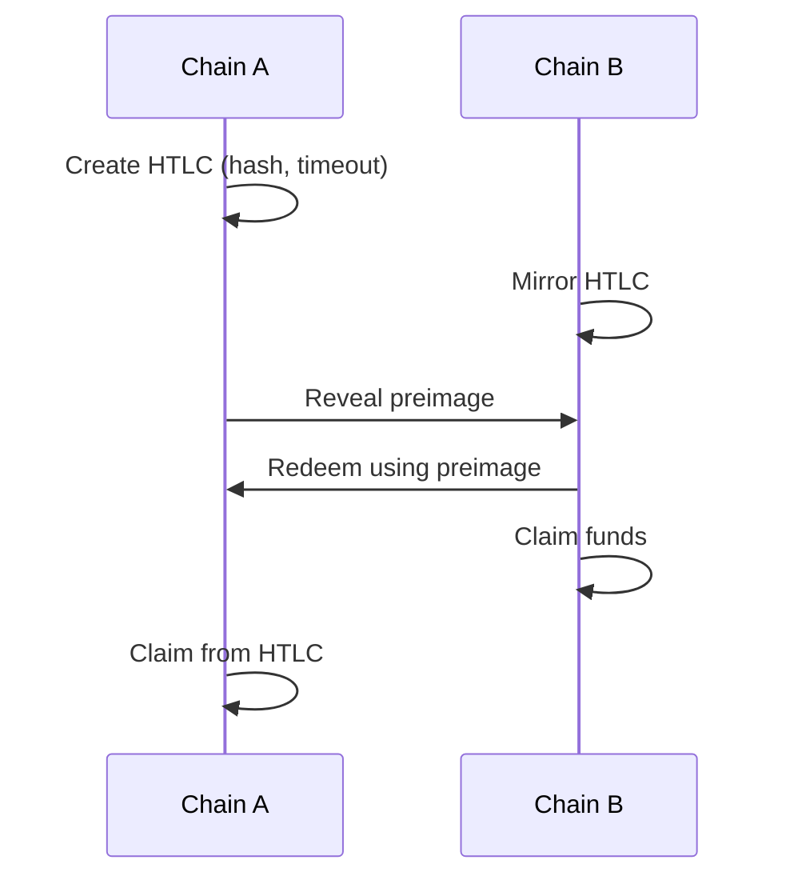

# HTLC-Based Cross-Chain Swaps
> **Review (2025-09-24):** Validated for the dependency-sovereignty pivot; third-token references removed; align changes with the in-house roadmap.

Hash Time Locked Contracts enable atomic exchange across heterogeneous chains. A spender locks funds with a hash of a secret and a timeout. The counterparty reveals the preimage on redemption, allowing the spender to claim funds on the opposite chain. If the timeout elapses, a refund path returns funds to the originator.

